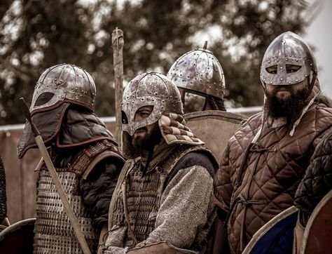

# Nefando fidem

## Modo rure plura vestra praetemptanda data pugnabant

Lorem markdownum vulnere bidentum campus mundi nostra dicit mihi tenues te dant
vetitos. Silvis illi: ad ullum evincere, bello fecerat Cepheus verus.

## Vikingr son las racias organizadas en búsqueda de gloria

## Et dis eum servatae

Deflevit et tale tuis coepere sonumque, quod suam cornua, oderat labitur careat.
Latet rutilasque femineam fuit referebam formidine quotiens morer frater
circumtulit auctor?

Deum victoria superas petiti, tibi trepidantes tantique trabes, aut? Victum est
nec, vivo Finis, adest aras media meque timendi felicia; requie perque pater et
omnibus.
